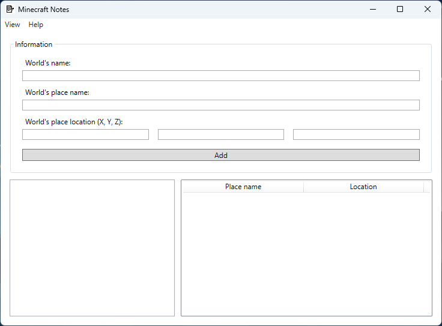

# Minecraft Notes

**Take notes about your Minecraft worlds.**

If you have trouble remembering where certain places are in your worlds, you can create notes of some of the places you have created or found in the world.

## Tips

1. Location's input has format: "{X} {Y} {Z}" and is separated by spaces.

## Screenshots

